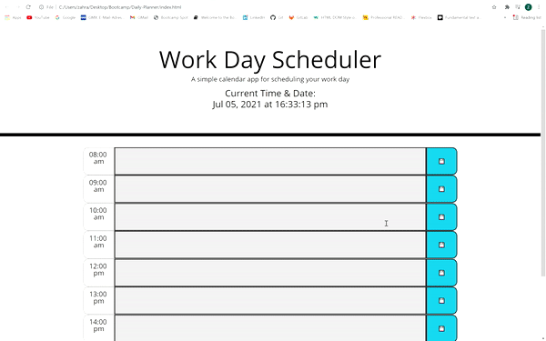

### Code-Quiz

## General Information

The deployed Webpage is a simple calendar application that allows a user to save events for each hour of the day. This app will run in the browser and feature dynamically updated HTML and CSS powered by jQuery and moment.js.

* Deployed URL of the Quiz: https://zahramertens.github.io/Daily-Planner/
* URL of the GitHub Repo: https://github.com/ZahraMertens/Daily-Planner.git

## Table if Contents
1. [General Information](#general-informaion)
2. [Task Description](#task-description)
3. [Mock-Up](#mock-up)
4. [Bonus](#bonus)
5. [Credits](#credits)

## Task Describtion

There was a given starter code including the main features and the style.css file. As our task we had to modify the calender application by writing the Javascript code to give it functionality especially by using moment.js. 

## Actual Behaviour

* WHEN I open the planner THEN the current day is displayed at the top of the calendar

* WHEN I scroll down THEN I am presented with timeblocks for standard business hours

* WHEN I view the timeblocks for that day THEN each timeblock is color coded to indicate whether it is in the past, present, or future

* WHEN I click into a timeblock THEN I can enter an event

* WHEN I click the save button for that timeblock THEN the text for that event is saved in local storage

* WHEN I refresh the page THEN the saved events persist

## 🏆 Bonus

* WHEN I double-click the save button for that timeblock THEN the text for that event is removed from the local storage and the webpage gets reload to remove the text 

* WHEN I resize the page THEN I am presented with a responsive layout by using bootstraps grid layout

* WHEN hover over the buttons THEN there is a tooltip displayed which explains that one click will save the input and a doule click removes the text

## Mock-Up

The following GIF shows the web applications apperance and functionality:

## Credits

* https://blog.bitsrc.io/understanding-asynchronous-javascript-the-event-loop-74cd408419ff

* https://momentjs.com/

* https://devhints.io/moment

* https://stackoverflow.com/questions/15993913/format-date-with-moment-js
